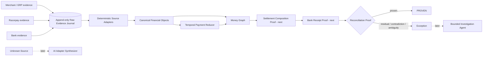

# ReFlow

**Every rupee gets a path, a proof, or an exception.**

> Razorpay AI Buildathon 2026 · Track 04 — AI Finance Controller
>
> **Current phase: deterministic foundation audited through Gates 0–6; settlement and bank proof engines are next.**

ReFlow is an evidence-first **financial truth compiler** for payment settlement reconciliation.

It is being built to compile messy merchant, Razorpay and bank evidence into a temporal **Money Graph**, prove how payments/refunds/transfers/adjustments compose into settlements, prove the bank receipt independently, and emit a machine-verifiable **Reconciliation Proof**. Anything the deterministic engine cannot prove becomes a residual, contradiction, ambiguity or exception.

AI has two planned, bounded jobs:

1. **Source Adapter Synthesizer** — understand unfamiliar financial exports and propose a constrained adapter that must compile and pass deterministic financial tests before activation.
2. **Exception Investigation Agent** — use read-only evidence/proof tools to investigate unresolved cases and propose the next safe step.

**The LLM never decides whether money reconciles.** Neither AI layer has been added yet.

---

## Why this project

A simplistic reconciliation implementation matches one gateway row to one bank row. ReFlow deliberately targets a harder shape: one settlement can be composed from many economic movements before one or more bank-side credits appear.

The core question is not:

> “Which row looks similar?”

It is:

> **“Can we produce an auditable proof of every financial movement that explains this settlement, and state exactly what evidence is missing when we cannot?”**

---

## Current deterministic pipeline



Raw evidence is journaled **before** canonicalization. This is intentional: malformed evidence must remain auditable even when the deterministic adapter rejects it.

---

## What exists today

### Gates 0–3 — merged foundation

- repository engineering constitution;
- one-command validation and GitHub Actions CI;
- signed integer-paise money contracts;
- strongly typed financial IDs;
- timezone-aware canonical event models;
- hidden synthetic financial-world generator;
- adversarial observation corruption;
- explicit separation of hidden truth from candidate observations.

### Gates 4–6 — current audited checkpoint

- fail-closed adapters for the **normalized synthetic/known fixture schemas**;
- append-only raw source envelopes with deterministic hashes and deep payload immutability;
- journal-first ingestion, including retention of malformed rows before adapter failure;
- idempotent source replay;
- pure payment-state reconstruction independent of delivery order;
- safe handling of `failed → captured` evidence;
- retry deduplication that separates provider facts from local receive time;
- Money Graph edges built only from deterministic evidence;
- recon entries as first-class provenance nodes;
- graph edge precision/recall tests against hidden truth;
- duplicate recon evidence visible to the benchmark rather than silently collapsed.

The audit that followed the first Gate 6 implementation found real defects in temporal truth, immutability, retry semantics, graph scoring and adapter validation. Those failures and their regression tests are preserved in [`FAILURE_LOG.md`](FAILURE_LOG.md).

---

## Important source boundary

The current Phase 4 recon adapter consumes a **normalized synthetic schema** containing fields such as:

```text
gross_amount_paise
fee_paise
tax_paise
settlement_effect_paise
```

It is **not** the final production Razorpay Settlement Recon adapter.

The real Razorpay integration phase must normalize Razorpay's authoritative Recon fields such as `debit`, `credit`, `amount`, `fee` and `tax` using fixture-tested source semantics. Synthetic formulas are not allowed to masquerade as production API semantics.

See [`LIMITATIONS.md`](LIMITATIONS.md) for the exact non-claims.

---

## Core boundaries

- Money is signed **integer paise**, never float.
- Currency and amount unit are explicit.
- Raw source evidence is append-only and provenance is preserved.
- A malformed source row is retained even when canonicalization fails.
- Duplicate/retried delivery cannot duplicate economic value.
- Arrival order cannot silently define final payment truth.
- `payment.failed → payment.captured` is a valid evidence sequence.
- Settlement composition arithmetic is deterministic.
- Settlement processing and bank receipt are separate facts.
- UTR/authoritative IDs outrank fuzzy similarity.
- A zero residual is necessary but never sufficient proof of identity.
- Ambiguity fails closed.
- Unknown source unit/sign semantics quarantine the evidence rather than guess.
- Hidden simulator truth cannot be imported by production/reconciliation modules.
- AI cannot mutate financial truth or independently mark a settlement reconciled.

---

## Evaluation before claims

**No final benchmark result is claimed yet.**

The evaluation design generates an authoritative hidden financial world and separately generates imperfect observations. Candidate reconciliation code receives only the observed side.

Implemented adversarial shapes already include:

- duplicate and reordered webhooks;
- delayed webhooks;
- `failed → captured` evidence;
- dropped events;
- refunds and cross-period refunds;
- transfers and adjustments;
- missing, duplicate and wrong recon rows;
- missing, delayed, split and incorrect bank credits;
- same-amount settlement collisions;
- UTR removal/corruption;
- malformed dates and schema drift;
- rupee/paise and sign traps;
- prompt-like bank narration;
- partial source outages;
- high-cardinality settlement cases.

The safety metric that matters most is **silent false auto-match rate**. A confident wrong financial match is worse than an explicit unresolved case.

Final match-rate, accuracy, throughput and scale numbers will only be published after the checked-in held-out evaluation harness exists.

---

## Next implementation gates

### Phase 7 — Settlement Composition Proof

For each settlement:

- collect authoritative recon rows;
- validate row identity and canonical signs;
- detect duplicate economic evidence;
- calculate exact net composition;
- compare it to the settlement entity;
- emit an exact component proof or residual.

### Phase 8 — Bank Receipt Proof

Bank identity will be conservative. Exact UTR plus exact amount and valid source/time constraints can prove a normal bank receipt. Same amount plus approximate date cannot.

Split-credit support must require evidence binding all component bank rows to the settlement.

### Phase 9 — Full Proof + versioning

Composition proof and bank proof become independent fragments of a versioned full reconciliation proof. Late evidence must reopen only affected proof fragments while preserving the old version.

Only after those gates pass do baseline benchmarking, AI adapter synthesis, AI exception investigation and UI work begin.

---

## Commands

```bash
python -m pip install -e '.[dev]'
make check
```

Equivalent explicit checks:

```bash
python -m ruff check .
python -m mypy src
python -m pytest
```

CI runs the same validation path.

---

## Research and planning

### Foundation

- [`docs/01_BUILDATHON_BRIEF.md`](docs/01_BUILDATHON_BRIEF.md) — challenge bar and success criteria
- [`docs/02_RAZORPAY_RESEARCH.md`](docs/02_RAZORPAY_RESEARCH.md) — settlement, recon, webhook and AI-platform research
- [`docs/03_COMPETITIVE_ANALYSIS.md`](docs/03_COMPETITIVE_ANALYSIS.md) — track decision and competitive scan
- [`docs/04_PRODUCT_SPEC.md`](docs/04_PRODUCT_SPEC.md) — original product scope and domain objects
- [`docs/05_ARCHITECTURE.md`](docs/05_ARCHITECTURE.md) — original evidence-first architecture
- [`docs/06_EVALUATION_PLAN.md`](docs/06_EVALUATION_PLAN.md) — adversarial evaluation protocol
- [`docs/07_FAILURE_SAFETY_MODEL.md`](docs/07_FAILURE_SAFETY_MODEL.md) — failure taxonomy and guard boundaries
- [`docs/08_EXECUTION_ROADMAP.md`](docs/08_EXECUTION_ROADMAP.md) — gated roadmap
- [`docs/09_DEMO_SUBMISSION_PLAN.md`](docs/09_DEMO_SUBMISSION_PLAN.md) — pitch and review questions

### Current direction

- [`docs/10_FINANCE_OPS_PROBLEM_LANDSCAPE.md`](docs/10_FINANCE_OPS_PROBLEM_LANDSCAPE.md)
- [`docs/11_NOVEL_PRODUCT_THESIS.md`](docs/11_NOVEL_PRODUCT_THESIS.md)
- [`docs/12_MONEY_GRAPH_AND_RECONCILIATION_PROOFS.md`](docs/12_MONEY_GRAPH_AND_RECONCILIATION_PROOFS.md)
- [`docs/13_MESSY_DATA_AND_CONNECTOR_COMPILER.md`](docs/13_MESSY_DATA_AND_CONNECTOR_COMPILER.md)
- [`docs/14_SCALE_PERFORMANCE_AND_RESILIENCE.md`](docs/14_SCALE_PERFORMANCE_AND_RESILIENCE.md)
- [`docs/15_RAZORPAY_ALIGNMENT_AND_JUDGING_STRATEGY.md`](docs/15_RAZORPAY_ALIGNMENT_AND_JUDGING_STRATEGY.md)
- [`docs/16_MASTER_BUILD_PLAN.md`](docs/16_MASTER_BUILD_PLAN.md) — implementation contract
- [`docs/17_RESEARCH_SOURCEBOOK.md`](docs/17_RESEARCH_SOURCEBOOK.md)

### Honesty / review artifacts

- [`FAILURE_LOG.md`](FAILURE_LOG.md) — genuine implementation failures and fixes
- [`LIMITATIONS.md`](LIMITATIONS.md) — current limitations and explicit non-claims

---

## Build status

### Research / planning

- [x] competition and application-form research
- [x] Razorpay domain/API research
- [x] competitive and finance-ops research
- [x] Track 04 decision
- [x] financial-truth-compiler thesis
- [x] Money Graph / proof protocol
- [x] connector compiler and safety model
- [x] evaluation strategy
- [x] master implementation plan

### Deterministic implementation

- [x] repository engineering constitution / CI
- [x] financial domain contracts
- [x] synthetic hidden world
- [x] observation corruption engine
- [x] normalized deterministic known-source adapters
- [x] append-only raw evidence journal
- [x] journal-first ingestion
- [x] temporal payment reducer
- [x] provenance-preserving Money Graph
- [ ] settlement composition proofs
- [ ] bank receipt proofs
- [ ] full proof versioning
- [ ] residual solver
- [ ] baseline evaluation harness
- [ ] exception fingerprinting
- [ ] scale benchmark
- [ ] real Razorpay Test Mode / Settlement Recon adapter evidence

### AI / product surface

- [ ] Source Adapter Synthesizer
- [ ] Exception Investigation Agent
- [ ] operator UI
- [ ] failure campaign
- [ ] final benchmark
- [ ] public deployment
- [ ] five-minute pitch

---

## Engineering rule

If implementation evidence contradicts the design, **the design changes**.

ReFlow will not preserve an attractive architecture, AI feature or benchmark claim after testing proves it wrong.
