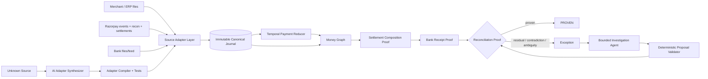

# ReFlow

**Every rupee gets a path, a proof, or an exception.**

> Razorpay AI Buildathon 2026 · Track 04 — AI Finance Controller
>
> **Current phase: research and architecture. Implementation has intentionally not started yet.**

ReFlow is an evidence-first **financial truth compiler** for payment settlement reconciliation.

It compiles messy merchant, Razorpay and bank evidence into a canonical temporal **Money Graph**, reconstructs how payments/refunds/transfers/adjustments compose into settlements, proves the bank receipt, and emits a machine-verifiable **Reconciliation Proof**. Anything it cannot prove becomes an explicit residual or exception.

AI has two meaningful but bounded jobs:

1. **Source Adapter Synthesizer** — understands unfamiliar financial exports and proposes a constrained adapter that must compile and pass deterministic financial tests before activation.
2. **Exception Investigation Agent** — uses read-only evidence tools to investigate unresolved cases and propose the next safe step.

**The LLM never decides whether money reconciles.**

---

## Why this project

Razorpay's Track 04 asks builders to close one finance-ops loop across a **50+ record synthetic batch** and report match rate, throughput, measured accuracy and the exceptions that could not be resolved.

A simplistic implementation can match one gateway row to one bank row. ReFlow deliberately targets the harder financial shape present in Razorpay's own Settlement Recon model: settlements can contain many payments, refunds, transfers and adjustments with fees/tax before one or more bank-side credits appear.

The core question is therefore not:

> “Which row looks similar?”

It is:

> **“Can we produce an auditable proof of every financial movement that explains this settlement, and state exactly what evidence is missing when we cannot?”**

---

## Research conclusion

The research phase changed the design substantially.

ReFlow is **not**:

- a chatbot over settlement CSVs;
- an LLM that guesses row matches;
- a screenshot/UTR matcher;
- a generic “agent decides, rule engine approves” demo.

Its differentiating systems primitives are:

- **Money Graph** — economic movements and evidence relationships instead of flat row pairs;
- **Reconciliation Proofs** — machine-checkable amount/identity/provenance evidence for every green result;
- **Residual Solver** — investigates exact unexplained value rather than blindly increasing fuzzy-match thresholds;
- **Temporal Truth** — preserves what was known when and versions proofs as late events arrive;
- **Source Adapter Compiler** — AI understands unknown schemas once; deterministic compiled adapters handle runtime data;
- **Schema Drift Watchdog** — unsafe source changes are quarantined before corrupting reconciliation;
- **Exception Fingerprints** — repeated exceptions become systemic incidents instead of thousands of independent tickets;
- **Proof-carrying AI** — every AI hypothesis must cite actual evidence objects and cannot create financial facts.

---

## System shape



---

## Core boundaries

- Money is signed **integer paise**, never float.
- Currency and amount unit are explicit.
- Raw source evidence is append-only and provenance is preserved.
- Webhook/event ingestion is idempotent and order-safe.
- `payment.failed → payment.captured` is treated as a real event sequence, not an impossible state.
- Settlement arithmetic is deterministic.
- Settlement processing and bank receipt are separate facts.
- UTR/ID evidence outranks fuzzy similarity.
- A zero residual does not prove identity by itself.
- Ambiguity fails closed into review.
- Unknown source unit/sign semantics quarantine the batch.
- AI receives finite read-only tools and cannot mutate financial truth.
- Any AI-proposed resolution must pass the proof engine again.
- The core batch works without an LLM or external model API.

---

## Small data and large data use the same truth model

### Small merchant

```text
Drop 3 ugly files
→ ReFlow maps the formats
→ deterministic validation
→ reconcile
→ inspect 2–3 exceptions
→ export proof
```

### High-volume operator

```text
continuous events + batch feeds
→ approved versioned adapters
→ partitioned/indexed reconciliation
→ cheap exact proof path for normal cases
→ residual/AI work only on exception frontier
→ cluster systemic incidents
```

The implementation scales by changing execution strategy, **not by changing financial semantics**.

---

## Evaluation before claims

No benchmark result is claimed yet.

The planned evaluation creates a hidden financial world and separately generates imperfect observations. Ground truth is unavailable to the candidate reconciliation pipeline and AI agent.

Adversarial cases include:

- duplicate and out-of-order webhooks;
- late `payment.failed → payment.captured` transitions;
- refunds, adjustments and cross-period movements;
- missing/wrong recon components;
- settlement processed before bank credit;
- missing/split bank credits;
- same-amount settlement collisions;
- exact UTR with wrong amount;
- malformed and drifting source schemas;
- rupee/paise and debit/credit sign traps;
- prompt-like narration;
- AI hallucinated evidence;
- model/source outage.

The safety metric we care about most is **silent false auto-match rate**. A confident wrong financial match is worse than an explicit unresolved case.

Planned benchmark sizes include the Buildathon minimum and progressively larger runs; scale claims will only be published after reproducible measurement with hardware/runtime disclosure.

---

## Research and planning

### Foundation

- [`docs/01_BUILDATHON_BRIEF.md`](docs/01_BUILDATHON_BRIEF.md) — official challenge bar and success criteria
- [`docs/02_RAZORPAY_RESEARCH.md`](docs/02_RAZORPAY_RESEARCH.md) — settlement, recon, webhook and AI-platform research
- [`docs/03_COMPETITIVE_ANALYSIS.md`](docs/03_COMPETITIVE_ANALYSIS.md) — why we selected Track 04 after inspecting the public field
- [`docs/04_PRODUCT_SPEC.md`](docs/04_PRODUCT_SPEC.md) — original product scope and domain objects
- [`docs/05_ARCHITECTURE.md`](docs/05_ARCHITECTURE.md) — evidence-first base architecture
- [`docs/06_EVALUATION_PLAN.md`](docs/06_EVALUATION_PLAN.md) — initial adversarial evaluation protocol
- [`docs/07_FAILURE_SAFETY_MODEL.md`](docs/07_FAILURE_SAFETY_MODEL.md) — failure taxonomy and guard boundaries
- [`docs/08_EXECUTION_ROADMAP.md`](docs/08_EXECUTION_ROADMAP.md) — initial gated roadmap
- [`docs/09_DEMO_SUBMISSION_PLAN.md`](docs/09_DEMO_SUBMISSION_PLAN.md) — five-minute pitch and review questions

### Second research pass — current direction

- [`docs/10_FINANCE_OPS_PROBLEM_LANDSCAPE.md`](docs/10_FINANCE_OPS_PROBLEM_LANDSCAPE.md) — merchant/institution pain points, low/high-volume failure modes
- [`docs/11_NOVEL_PRODUCT_THESIS.md`](docs/11_NOVEL_PRODUCT_THESIS.md) — finance-compiler thesis and novel product primitives
- [`docs/12_MONEY_GRAPH_AND_RECONCILIATION_PROOFS.md`](docs/12_MONEY_GRAPH_AND_RECONCILIATION_PROOFS.md) — formal proof/evidence/residual model
- [`docs/13_MESSY_DATA_AND_CONNECTOR_COMPILER.md`](docs/13_MESSY_DATA_AND_CONNECTOR_COMPILER.md) — safe AI-assisted schema understanding and drift handling
- [`docs/14_SCALE_PERFORMANCE_AND_RESILIENCE.md`](docs/14_SCALE_PERFORMANCE_AND_RESILIENCE.md) — one correctness model from small files to high-volume processing
- [`docs/15_RAZORPAY_ALIGNMENT_AND_JUDGING_STRATEGY.md`](docs/15_RAZORPAY_ALIGNMENT_AND_JUDGING_STRATEGY.md) — direct mapping to Buildathon page and actual submission form
- [`docs/16_MASTER_BUILD_PLAN.md`](docs/16_MASTER_BUILD_PLAN.md) — **current implementation contract; start here before coding**
- [`docs/17_RESEARCH_SOURCEBOOK.md`](docs/17_RESEARCH_SOURCEBOOK.md) — primary sources and the exact design implications taken from them

### Honesty / review artifacts

- [`FAILURE_LOG.md`](FAILURE_LOG.md) — real technical failures and fixes as implementation progresses
- [`LIMITATIONS.md`](LIMITATIONS.md) — known limitations and explicit non-claims

---

## Key research findings

- Razorpay Settlement Recon exposes settled `payment`, `refund`, `transfer` and `adjustment` movements, supporting a many-to-one settlement model.
- Razorpay webhooks use at-least-once delivery and may arrive out of order.
- Razorpay explicitly documents a possible `payment.failed` → `payment.captured` sequence for the same transaction.
- `settlement.processed` is not identical to “bank credit already visible”; UTR is used to reconcile settlement to bank evidence.
- Instant/Smart Settlement paths can produce different bank-credit shapes, so the domain should not permanently assume one settlement equals one bank row.
- Razorpay's own Agentic Platform already markets screenshot/UTR-assisted reconciliation, so that is not our novelty.
- Razorpay Agent Studio emphasizes verified first-party data, bounded permissions, independent validation and audit trails.
- Razorpay Engineering's current eval philosophy emphasizes bespoke system-level evals, reproducibility, safe failure and model optionality.
- Swift's payments research reinforces that a small percentage of exceptions can consume disproportionate operations effort, which supports ReFlow's exception-frontier design.

See the sourcebook for links and boundaries around these claims.

---

## Build status

### Research / planning

- [x] Competition research
- [x] Actual application-form research
- [x] Razorpay domain/API research
- [x] Current Razorpay AI/product-direction research
- [x] Competitive scan
- [x] Finance-ops industry problem research
- [x] Track decision
- [x] Novel product thesis
- [x] Money Graph / proof protocol
- [x] Messy data / connector compiler plan
- [x] scale / resilience plan
- [x] evaluation strategy
- [x] judging strategy
- [x] master implementation plan
- [x] failure/limitations scaffolding

### Implementation

- [ ] repository engineering constitution / CI
- [ ] financial domain contracts
- [ ] synthetic hidden world
- [ ] observation corruption engine
- [ ] deterministic known-source adapters
- [ ] immutable journal
- [ ] temporal payment reducer
- [ ] Money Graph
- [ ] settlement composition proofs
- [ ] bank receipt proofs
- [ ] proof versioning
- [ ] residual solver
- [ ] baseline evaluation harness
- [ ] Source Adapter Synthesizer
- [ ] Exception Investigation Agent
- [ ] exception fingerprinting
- [ ] scale benchmark
- [ ] Razorpay Test Mode adapter/demo evidence
- [ ] operator UI
- [ ] failure campaign
- [ ] final benchmark
- [ ] public deployment
- [ ] five-minute pitch

---

## Research rule

If implementation evidence contradicts this plan, **the plan changes**.

We will not preserve an attractive architecture, AI feature or benchmark claim after testing proves it wrong.
