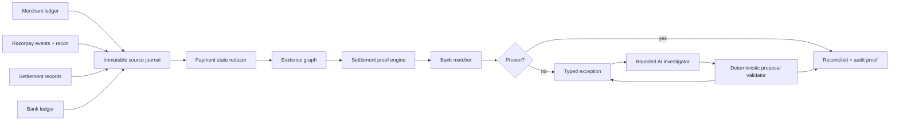

# ReFlow

**Every rupee, explained.**

> Razorpay AI Buildathon 2026 · Track 04 — AI Finance Controller
>
> **Current phase: research and architecture. Implementation has intentionally not started yet.**

ReFlow is an evidence-first AI finance controller for **many-to-one payment settlement reconciliation**.

It reconstructs payment truth from an imperfect event journal, proves how payments/refunds/adjustments compose into a Razorpay settlement, links that settlement to bank-credit evidence, and turns anything it cannot prove into an explicit exception. A bounded AI investigator can gather additional evidence and propose the next safe step, but **the LLM never decides whether money reconciles**.

## Why this project

The Buildathon asks Track 04 projects to close a finance-ops loop across 50+ synthetic records while reporting match rate, throughput, measured accuracy and unresolved exceptions.

A simplistic implementation can match one gateway row to one bank row. ReFlow deliberately targets the harder shape suggested by Razorpay's own Settlement Recon model: a settlement can contain multiple payments, refunds, transfers and adjustments, with fees/tax and one settlement-level bank transfer/UTR.

So the core question is not:

> “Which bank row looks similar to this payment?”

It is:

> **“Can we produce an auditable proof of every financial movement that explains this settlement, and safely identify exactly what is missing when we cannot?”**

## Planned system

### Core boundaries

- Money is signed **integer paise**, never float.
- Webhook/event ingestion is idempotent and order-safe.
- Settlement arithmetic is deterministic.
- UTR/ID evidence outranks fuzzy similarity.
- Ambiguity fails closed into review.
- AI receives a finite set of read-only investigation tools.
- AI cannot mutate source records or mark a settlement reconciled.
- Any AI-proposed resolution must pass the deterministic proof engine again.
- The core batch works without an LLM or external model API.

## Evaluation before claims

No benchmark result is claimed yet.

The planned final benchmark will use a seedable hidden financial world and separately generated imperfect observations. Ground truth is unavailable to the reconciliation engine and agent.

Target evaluation scale is **1,000+ transaction-level records** across grouped settlements with adversarial cases including:

- duplicate webhooks;
- out-of-order events;
- late `payment.failed → payment.captured` transitions;
- refunds and adjustments;
- missing/wrong recon components;
- processed settlement before bank credit;
- missing bank credit;
- same-amount settlements;
- exact UTR with wrong amount;
- duplicate/unknown bank entries;
- ambiguous evidence;
- malformed source records;
- LLM hallucinated evidence and provider failure.

The safety metric we care about most is **silent false auto-match rate**. A confident wrong match is more dangerous than an explicit unresolved case.

## Research and planning

Start here:

- [`docs/01_BUILDATHON_BRIEF.md`](docs/01_BUILDATHON_BRIEF.md) — official challenge bar and our success criteria
- [`docs/02_RAZORPAY_RESEARCH.md`](docs/02_RAZORPAY_RESEARCH.md) — settlement, recon, webhook and AI-platform research
- [`docs/03_COMPETITIVE_ANALYSIS.md`](docs/03_COMPETITIVE_ANALYSIS.md) — why we chose Track 04 after inspecting the public field
- [`docs/04_PRODUCT_SPEC.md`](docs/04_PRODUCT_SPEC.md) — exact finance loop, entities, statuses and AI responsibilities
- [`docs/05_ARCHITECTURE.md`](docs/05_ARCHITECTURE.md) — evidence-first technical architecture
- [`docs/06_EVALUATION_PLAN.md`](docs/06_EVALUATION_PLAN.md) — adversarial corpus, baselines and metrics
- [`docs/07_FAILURE_SAFETY_MODEL.md`](docs/07_FAILURE_SAFETY_MODEL.md) — failure taxonomy and guard boundaries
- [`docs/08_EXECUTION_ROADMAP.md`](docs/08_EXECUTION_ROADMAP.md) — gated plan through submission
- [`docs/09_DEMO_SUBMISSION_PLAN.md`](docs/09_DEMO_SUBMISSION_PLAN.md) — five-minute pitch, visuals and review questions

## Key Razorpay sources

- Buildathon: https://razorpay.com/buildathon/
- Settlement Recon API: https://razorpay.com/docs/api/settlements/fetch-recon/
- Settlement webhooks: https://razorpay.com/docs/webhooks/settlements/
- Payment webhooks: https://razorpay.com/docs/webhooks/payments/
- Webhook best practices: https://razorpay.com/docs/webhooks/best-practices/
- Settlement break-up: https://razorpay.com/docs/payments/settlements/dashboard/
- Agentic Platform: https://razorpay.com/blog/razorpay-agentic-platform/
- Agent Studio guardrails: https://razorpay.com/blog/razorpay-agent-studio-principles-guardrails-and-merchant-control/
- Razorpay engineering eval philosophy: https://razorpay.com/blog/?p=27428

## Build status

- [x] Competition research
- [x] Razorpay domain research
- [x] Competitive scan
- [x] Track decision
- [x] Product specification
- [x] Architecture plan
- [x] Evaluation protocol
- [x] Failure/safety model
- [x] Execution + demo plan
- [ ] Financial domain contracts
- [ ] Synthetic world + observation generator
- [ ] Event reducer
- [ ] Settlement proof engine
- [ ] Bank matcher + exceptions
- [ ] Evaluation harness
- [ ] Bounded AI investigator
- [ ] Operator UI
- [ ] Razorpay Test Mode adapter
- [ ] Final adversarial benchmark
- [ ] Public deployment
- [ ] Five-minute pitch

## Research rule

If implementation evidence contradicts this plan, **the plan changes**. We will not preserve an attractive architecture or benchmark claim after testing proves it wrong.
