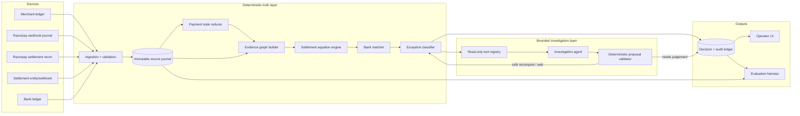

# ReFlow Architecture

## Architecture goal

The system must make it mechanically difficult for an LLM mistake to become a financial mistake.

The architecture therefore separates five concerns:

1. immutable source ingestion;
2. deterministic state reconstruction;
3. deterministic financial reconciliation;
4. bounded AI investigation;
5. audit/evaluation.



## Recommended implementation stack

The exact language is less important than correctness, but the implementation should optimize for shipping a polished, inspectable system quickly.

### Monorepo

```text
reflow/
├── apps/
│   ├── api/                 # API, ingestion, orchestration
│   └── web/                 # operator console
├── packages/
│   ├── domain/              # typed financial contracts
│   ├── ingestion/           # adapters + canonicalization
│   ├── payment-state/       # event reducer
│   ├── reconciliation/      # equations, graph, matching, decisions
│   ├── agent/               # tools, schemas, provider adapters
│   ├── simulator/           # synthetic world + corruptions
│   └── eval/                # metrics + reports
├── data/
│   ├── fixtures/
│   ├── generated/
│   └── eval/
├── tests/
├── docs/
└── scripts/
```

### Backend

Recommended: **Python 3.12 + FastAPI + Pydantic + SQLAlchemy/SQLModel + PostgreSQL**.

Reasons:

- fastest path to strong data/eval tooling;
- typed Pydantic boundaries;
- mature property-based/testing ecosystem;
- straightforward model-provider integrations;
- easy generation of deterministic synthetic corpora;
- readable to reviewers.

SQLite can be used for local development, but PostgreSQL is preferable for the deployed demo if setup remains simple. Do not add Kafka/Redis unless a measured need appears.

### Frontend

Recommended: **React + TypeScript + Vite** (or Next.js only if a feature genuinely needs it).

The frontend is not the source of financial calculations. It renders API-provided proof objects, metrics and audit data.

### Money representation

Canonical money type:

```text
Money = {
  currency: "INR",
  amount_paise: signed int64
}
```

No IEEE-754 float in domain contracts, database arithmetic or eval ground truth.

## Source ingestion

Every incoming source record gets an envelope:

```text
SourceEnvelope
- source_kind
- source_record_id
- source_event_id? 
- occurred_at
- received_at
- payload_sha256
- schema_version
- raw_payload / normalized snapshot
- validation_status
```

Deduplication uses source-native stable IDs plus payload hashes. A duplicate is recorded as a duplicate event for audit but does not create duplicate economic movement.

Malformed records are retained as rejected source evidence. They are not silently dropped from evaluation.

## Payment state reducer

Webhook/event history is reduced into `PaymentCurrentState` with explicit transition precedence and monotonic business facts.

Required properties:

- duplicate event idempotency;
- out-of-order tolerance;
- later capture can supersede an earlier failed observation when Razorpay semantics permit it;
- a captured payment cannot be duplicated by repeated capture events;
- source event history remains immutable;
- reducer output is reproducible from journal alone.

The reducer should be a pure function wherever practical:

`reduce(events[]) -> PaymentCurrentState + warnings[]`

This makes adversarial permutation testing easy.

## Evidence graph

Represent reconciliation as a graph or graph-like relational model.

Nodes:

- merchant order;
- payment;
- refund;
- recon entry;
- settlement;
- bank entry.

Edges store:

- relationship type;
- evidence source;
- exact fields that established the relationship;
- whether it is candidate/proven/rejected;
- reason code.

The graph is not an excuse to introduce a graph database. PostgreSQL tables are sufficient. “Graph” describes the domain model and proof structure.

## Settlement equation engine

For each settlement:

1. load all recon entries that claim the settlement ID;
2. validate currency and integer ranges;
3. check entity uniqueness;
4. compute total credits and debits from documented row fields;
5. compute net;
6. compare net exactly to settlement amount;
7. retain a component breakdown and arithmetic proof;
8. never proceed to `PROVEN_RECONCILED` if the equation fails.

The output is a deterministic `SettlementProof` object.

## Bank matching

Candidate generation and authorization are separate.

### Candidate generation

Can use:

- exact UTR;
- amount;
- bounded time window;
- narration tokens;
- known bank settlement prefixes if a fixture explicitly models them.

### Authorization rules

Auto-link only when a rule can prove uniqueness and consistency.

Examples:

- exact UTR + exact amount + valid time relationship → strong proof;
- exact UTR + wrong amount → mismatch exception, **not** match;
- no UTR + unique exact amount inside narrow time window → candidate; whether it can auto-link should be an explicit benchmarked policy;
- fuzzy narration alone → never auto-authorizes.

## Exception classifier

Use ordered deterministic rules with reason codes. Preserve all detected violations even if only one primary status is shown.

Example:

```text
primary_status = BANK_AMOUNT_MISMATCH
reason_codes = [
  EXACT_UTR_MATCH,
  EXPECTED_1524300_PAISE,
  OBSERVED_1519300_PAISE,
  RESIDUAL_5000_PAISE
]
```

The decision engine must have exhaustive tests over reachable combinations, or property tests if a full truth table becomes too large.

## Agent boundary

The model never receives a database connection or arbitrary SQL tool.

It receives:

- a typed exception summary;
- a finite registry of read-only tools;
- enumerated allowed next-step proposals;
- a bounded tool-call budget;
- a time/token budget.

Structured model output:

```text
InvestigationProposal
- root_cause: enum
- evidence_ids: list[ID]
- next_step: enum
- explanation: string
- missing_evidence: list[enum]
```

There is **no `amount` field that the model is trusted to supply as financial truth**. If an amount appears in prose, a faithfulness validator checks it against tool outputs before displaying it.

## Proposal validator

Every AI proposal is checked for:

- referenced evidence exists;
- cited evidence belongs to the current merchant/case;
- root cause is compatible with deterministic reason codes;
- proposed action is allowed for current state;
- no source or financial fact would be mutated without approval;
- resolution requires rerunning deterministic invariants.

If validation fails, record `AGENT_PROPOSAL_REJECTED` and either allow one bounded re-plan or escalate.

## Audit ledger

Every important step is append-only:

- source receipt;
- deduplication result;
- payment-state reduction version;
- evidence edge created/rejected;
- settlement equation output;
- bank-match decision;
- exception creation;
- agent prompt/run metadata;
- tool calls and tool outputs by hash/reference;
- proposal validation;
- resolution/escalation.

A hash-chain is optional. A tamper-evident hash chain is a good stretch feature only after correctness and evaluation are complete.

## API surface — planned

```text
POST /api/v1/ingest/merchant-ledger
POST /api/v1/ingest/razorpay-event
POST /api/v1/ingest/recon
POST /api/v1/ingest/settlements
POST /api/v1/ingest/bank-ledger

POST /api/v1/batches/{id}/reconcile
GET  /api/v1/batches/{id}
GET  /api/v1/settlements/{id}/proof
GET  /api/v1/exceptions
GET  /api/v1/exceptions/{id}
POST /api/v1/exceptions/{id}/investigate
POST /api/v1/exceptions/{id}/recompute
POST /api/v1/exceptions/{id}/escalate

GET  /api/v1/audit
GET  /api/v1/evaluation/latest
GET  /health
```

Actual Razorpay webhook route will verify signatures against the **raw body** and retain only safe bounded payload data.

## Reliability properties to prove in tests

- event ingestion is idempotent;
- reconciliation run is idempotent;
- event permutation does not change final state for semantically equivalent histories;
- integer sum is conserved;
- an ambiguous match never becomes auto-match merely due to input ordering;
- duplicate bank rows cannot credit a settlement twice;
- agent unavailability does not break deterministic reconciliation;
- model hallucination cannot change a financial fact;
- source corruption creates an explicit exception;
- rerunning a completed batch does not duplicate decisions/economic movement.

## Deployment

Keep deployment boring:

- one API container;
- one web app/static deployment;
- one PostgreSQL database;
- environment-secret based credentials;
- HTTPS;
- health endpoint;
- structured logs;
- seed/demo command that works without external credentials;
- optional Razorpay Test Mode integration when keys are supplied.

The offline demo/evaluation path must remain functional even if Razorpay or the chosen model provider is unavailable during judging.
